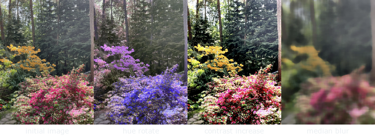
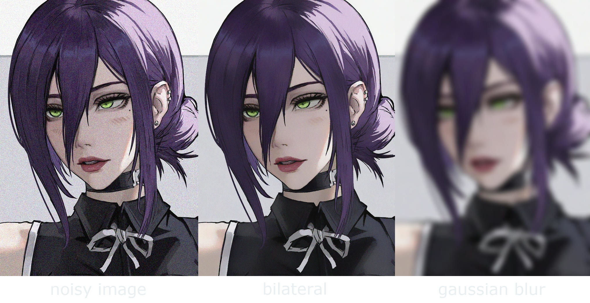
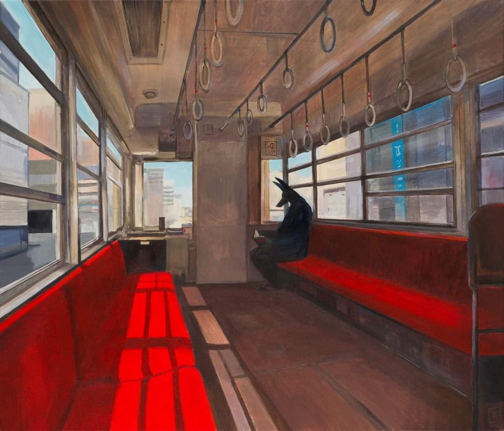
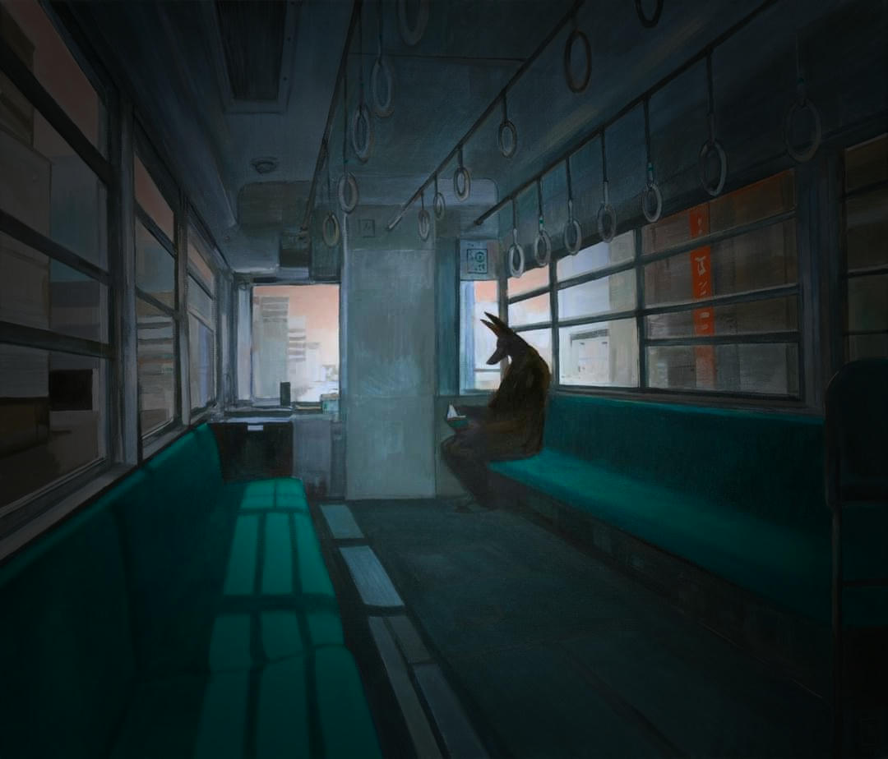

# Magrustte
Command line tool for image manipulation. Apply effects to images as a composition of filters in a pipeline-like manner,
which allows for adding and removing filters without the need to recalculate the whole image.  

Name is a portmanteau of the surname of a great surrealist painter René Magritte, and the name of the language it's
written in - Rust. It's also a subtle nod to Google's deprecated image manipulation tool - Picasa.

## Features
As of `0.6.9` release, the following filters are supported or planned to be supported in the near future:
- [x] Sepia
- [x] Color invert
- [x] Grayscale
- [x] Threshold
- [x] Vignette
- [x] Hue rotate
- [x] Brightness
- [x] Contrast
- [x] Blur with gaussian, box, and median kernels
- [x] Sharpen
- [x] Bilateral

## Installation
Just clone the repository and build the binary. Run the following commands:
```
git clone git@github.com:mihawb/magrustte.git
cd magrusste
cargo build --release
mv target/release/magrustte.exe .
./magrustte
```
Or simply:
```
git clone git@github.com:mihawb/magrustte.git
cd magrusste
cargo run --release
```

## Usage
Run `help` command in the app to see usage instructions.

## Examples
### Filter showcase

> Image by author
### Noise reduction
Bilateral and gaussian filters with identical spatial kernel applied to a noisy image.

> Image courtesy of Kimsan.lee [on Twitter](https://twitter.com/Kimsanlee6/status/1735926920439803972).
### Remove non-enclosing filter
```
Welcome to Magrustte!
Type 'help' to see available commands.
> open
Image loaded.
> show
```

> Painting courtesy of Joanna Karpowicz: [Anubis in Hakone, acrylic on canvas, 2016](https://joannakarpowicz.pl/2018/02/10/anubis-in-hakone/).
```
> add huerotate 180
Huerotate filter added.
> add blur 10 gaussian
Blur filter added.
> add vignette 20 80
Vignette filter added.
> show
```

```
> list
0 Huerotate -> degrees: 180
1 Blur -> radius: 10, mode: Gaussian
2 Vignette -> radius: 20%, opacity: 80%
> remove 1
Filter at index 1 removed.
> show
```

